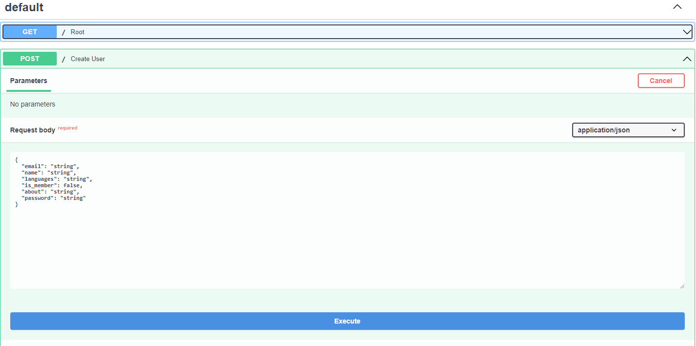
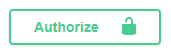
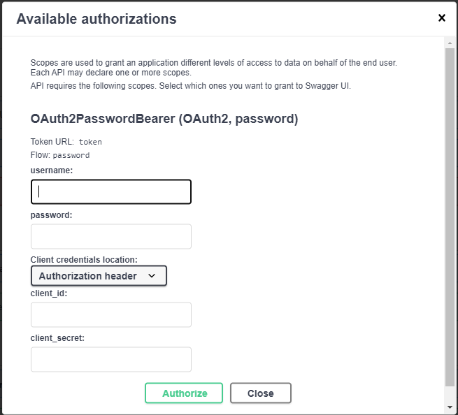

[![Contributors][contributors-shield]][contributors-url]
[![Forks][forks-shield]][forks-url]
[![Stargazers][stars-shield]][stars-url]
[![Issues][issues-shield]][issues-url]
[![MIT License][license-shield]][license-url]
[![DockerHub][docker-shield]][docker-url]
[![LinkedIn][linkedin-shield]][linkedin-url]


<!-- PROJECT LOGO -->
<br />
<p align="center">

  <h1 align="center">Homemade LinkedIn</h1>

  <p align="center">
    A homemade LinkedIn backend project that can save users' info into a database.
    <br />
    <a href="https://github.com/WenyuZhu/HomemadeLinkedIn"><strong>Explore the docs »</strong></a>
    <br />
    <a href="https://github.com/WenyuZhu/HomemadeLinkedIn/issues">Report Bug</a>
  </p>
</p>


<!-- TABLE OF CONTENTS -->
<details open="open">
  <summary>Table of Contents</summary>
  <ol>
    <li>
      <a href="#about-the-project">About The Project</a>
      <ul>
        <li><a href="#built-with">Built With</a></li>
      </ul>
    </li>
    <li>
      <a href="#getting-started">Getting Started</a>
      <ul>
        <li><a href="#prerequisites">Prerequisites</a></li>
        <li><a href="#installation">Installation</a></li>
      </ul>
    </li>
    <li><a href="#usage">Usage</a></li>
    <li><a href="#roadmap">Roadmap</a></li>
    <li><a href="#contributing">Contributing</a></li>
    <li><a href="#license">License</a></li>
    <li><a href="#contact">Contact</a></li>
    <li><a href="#acknowledgements">Acknowledgements</a></li>
  </ol>
</details>


<!-- ABOUT THE PROJECT -->
## About The Project

This project uses a RESTful service [FastAPI](https://fastapi.tiangolo.com) to develop a backend application. It that can store users' info into or read it from a database, such as education history, work experience, etc. Besides the CRUD operations, the security functions are also developed, including login with passwords then verify it with the hashed password and authenticate users with encoded token.

### Built With

* [FastAPI](https://fastapi.tiangolo.com)


<!-- GETTING STARTED -->
## Getting Started

### Prerequisites

* requirements.txt
  ```sh
  pip install -r requirements.txt
  ```

### Installation
#### Run on local terminal
1. Clone the repo
   ```sh
   git clone https://github.com/WenyuZhu/HomemadeLinkedIn.git
   ```
2. Navigate to folder HomemadeLinkedIn
3. Run the server
   ```cmd
   unicorn app.main:app --reload
   ```
4. Go to http://127.0.0.1:8000/docs in a browser.

#### Run on Docker 
1. Install the Docker from [Docker](https://www.docker.com/)
2. Run the application on Docker, input following command in command line:
   ```cmd
   docker run -p 80:80 arthaszwy/homemadelinkedin:0.1.0
   ```
   The version number may vary, please check before run the command.
<!-- USAGE EXAMPLES -->
## Usage

1. Before you can sign in, please create an account(an user), find the 'Create User' button under 'defualt' tag, then click try it out, input your info in the request body field and hit the 'execute' button. 
3. Now you can sign in to the server. Find the 'Authorize' button  on the top right corner, then input your email address in the 'username' field and the password.
4. After you signing in the server, you can do the read and save operation to the server.

_For more examples, please refer to the [FastAPI Tutorial](https://fastapi.tiangolo.com/tutorial/)_


<!-- LICENSE -->
## License

Distributed under the MIT License. See `LICENSE` for more information.


<!-- CONTACT -->
## Contact

Wenyu Zhu - [@LinkedIn](https://www.linkedin.com/in/wenyu-zhu-059856b7) - wzz0015@auburn.edu

Project Link: [https://github.com/WenyuZhu/HomemadeLinkedIn](https://github.com/WenyuZhu/HomemadeLinkedIn)

DockerHub Link: [https://hub.docker.com/repository/docker/arthaszwy/homemadelinkedin](https://hub.docker.com/repository/docker/arthaszwy/homemadelinkedin)


<!-- ACKNOWLEDGEMENTS -->
## Acknowledgements
* [FastAPI](https://fastapi.tiangolo.com/)


<!-- MARKDOWN LINKS & IMAGES -->
<!-- https://www.markdownguide.org/basic-syntax/#reference-style-links -->
[contributors-shield]: https://img.shields.io/github/contributors/WenyuZhu/HomemadeLinkedIn?style=flat-square
[contributors-url]: https://github.com/WenyuZhu/HomemadeLinkedIn/graphs/contributors
[forks-shield]: https://img.shields.io/github/forks/WenyuZhu/HomemadeLinkedIn?style=flat-square
[forks-url]: https://github.com/WenyuZhu/HomemadeLinkedIn/network/members
[stars-shield]: https://img.shields.io/github/stars/WenyuZhu/HomemadeLinkedIn?style=flat-square
[stars-url]: https://github.com/WenyuZhu/HomemadeLinkedIn/stargazers
[issues-shield]: 	https://img.shields.io/github/issues/WenyuZhu/HomemadeLinkedIn?style=flat-square
[issues-url]: https://github.com/WenyuZhu/HomemadeLinkedIn/issues
[license-shield]: https://img.shields.io/github/license/WenyuZhu/HomemadeLinkedIn?style=flat-square
[license-url]: https://github.com/WenyuZhu/HomemadeLinkedIn/blob/main/LICENSE
[linkedin-shield]: https://img.shields.io/badge/-LinkedIn-black.svg?style=flat-square&logo=linkedin&colorB=555
[linkedin-url]: https://www.linkedin.com/in/wenyu-zhu-059856b7/
[docker-shield]: https://img.shields.io/docker/v/arthaszwy/homemadelinkedin?style=flat-square
[docker-url]: https://hub.docker.com/repository/docker/arthaszwy/homemadelinkedin
[product-screenshot]: images/screenshot.png
